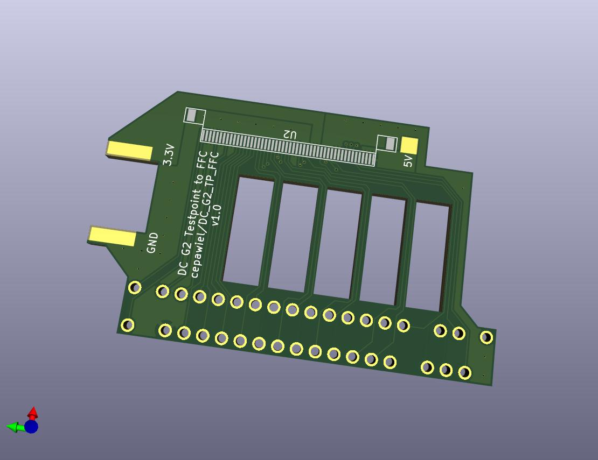

# DC_G2_TP_FFC
Dreamcast G2 Test Points to FFC Connector. This was designed for a VA1 console, have yet to test on VA0 or VA2.

## BOM
| Part              | Quantity | Description                              | URL                                                                                               |
|-------------------|----------|------------------------------------------|---------------------------------------------------------------------------------------------------|
| THD0515-50CL-SN   | 1        | 50Pin 0.5MM FFC Bottom Contact Connector | https://www.lcsc.com/product-detail/FFC-FPC-Connectors_THD-THD0515-50CL-SN_C283159.html           |
| JS05B-50P-150-4-8 | 1        | 50Pin 0.5MM FFC Opposite Side 15CM       | https://www.lcsc.com/product-detail/FFC-FPC-Connect-Cables_JUSHUO-JS05B-50P-150-4-8_C2857761.html |

## TODO
- [ ] Create FPC version to avoid this PCB and parts entirely
- [ ] Rotate connector 180 to exit the case in the existing G2 Area
- [ ] Add Castellated Hole for the 3.3V+GND to avoid jumper wires

## Version history
### V1.0
Tested working, ordered from JLCPCB. I chose 1.6mm thickness, but I might try thiner next time to make it easier to solder to the test points
